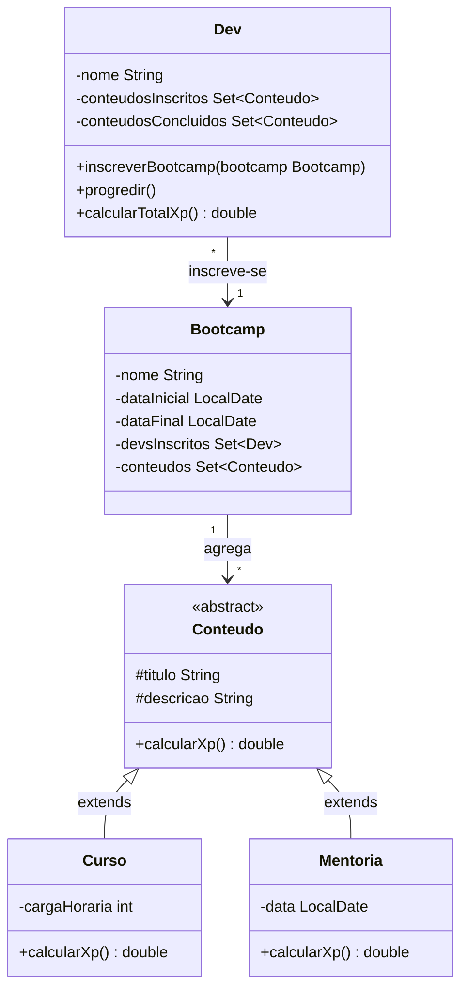

# Aprenda na Prática — Programação Orientada a Objetos

Projeto desenvolvido como parte do **Bootcamp Claro - Java com Spring Boot** na plataforma [DIO](https://www.dio.me/), com base no desafio original de **Camila Cavalcante**.
Título do desafio: Abstraindo um Bootcamp Usando Orientação a Objetos em Java
Link do desafio: https://github.com/cami-la/desafio-poo-dio
---

## Descrição

Modelagem do domínio de um Bootcamp de tecnologia, aplicando os quatro pilares da Programação Orientada a Objetos: Abstração, Encapsulamento, Herança e Polimorfismo. Um `Bootcamp` agrega `Conteudos` (Cursos e Mentorias), e `Devs` se inscrevem, progridem e acumulam XP conforme concluem cada conteúdo.

---

## Diagrama UML



---

## Os Quatro Pilares aplicados

**Abstração** — `Conteudo` é uma classe abstrata que representa o conceito genérico de "algo que gera XP", sem se comprometer com os detalhes de como cada tipo calcula esse valor.

**Encapsulamento** — atributos privados acessados apenas via getters/setters. Os setters de `Curso` e `Mentoria` incluem validação, impedindo estados inválidos (carga horária zero, data nula).

**Herança** — `Curso` e `Mentoria` herdam de `Conteudo`, reaproveitando `titulo`, `descricao` e o contrato `calcularXp()`.

**Polimorfismo** — `Dev.calcularTotalXp()` itera sobre `Set<Conteudo>` chamando `calcularXp()` de forma uniforme, sem saber (nem precisar saber) se está lidando com um `Curso` ou uma `Mentoria`. Cada subtipo resolve o cálculo à sua maneira.

---

## Evoluções em relação ao projeto de referência

| Melhoria | Detalhe |
|---|---|
| Validação em `Curso.setCargaHoraria()` | Lança `IllegalArgumentException` para valores ≤ 0 |
| Validação em `Mentoria.setData()` | Lança `IllegalArgumentException` para data nula |
| `XP_BONUS_MENTORIA` nomeado | Antes era o número mágico `20d` direto no cálculo |
| `Dev.calcularTotalXp()` com Stream | Removida a versão com `Iterator` + comentário morto |
| `Main.java` limpo | Removidos os comentários de código desativado |
| `toString()` em `Bootcamp` e `Dev` | Facilita depuração e visualização do estado do objeto |

---

## Estrutura do Projeto

```
desafio-poo-dio-claro/
└── src/
    ├── Main.java
    └── br/com/dio/desafio/dominio/
        ├── Conteudo.java
        ├── Curso.java
        ├── Mentoria.java
        ├── Bootcamp.java
        └── Dev.java
```

---

## Como Executar

**1. Compilar:**
```bash
javac -d bin $(find src -name "*.java")
```

**2. Executar:**
```bash
java -cp bin Main
```

**Saída esperada (resumo):**
```
Conteúdos Inscritos Camila: [Curso{...}, Curso{...}, Mentoria{...}]
-
Conteúdos Inscritos Camila: [Mentoria{...}]
Conteúdos Concluídos Camila: [Curso{...}, Curso{...}]
XP: 120.0
-------
...
XP: 150.0
-------
Bootcamp{nome='Bootcamp Java Developer', ...}
Dev{nome='Camila', ..., totalXp=120.0}
Dev{nome='Joao', ..., totalXp=150.0}
```

---

## Tecnologias

- Java 17+
- Orientação a Objetos — abstração, encapsulamento, herança, polimorfismo
- Streams API
- `Set` (LinkedHashSet, HashSet)
- `java.time.LocalDate`

---

## Autor

Desenvolvido durante o **Bootcamp Claro - Java com Spring Boot**
Plataforma: [DIO — Digital Innovation One](https://www.dio.me/)
Título do desafio: Abstraindo um Bootcamp Usando Orientação a Objetos em Java
Link do desafio: https://github.com/cami-la/desafio-poo-dio
